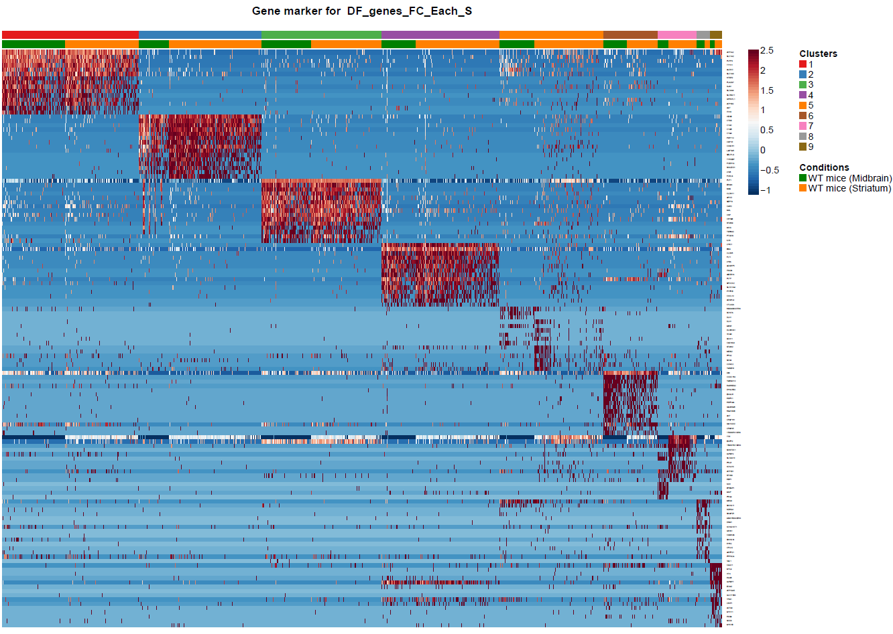
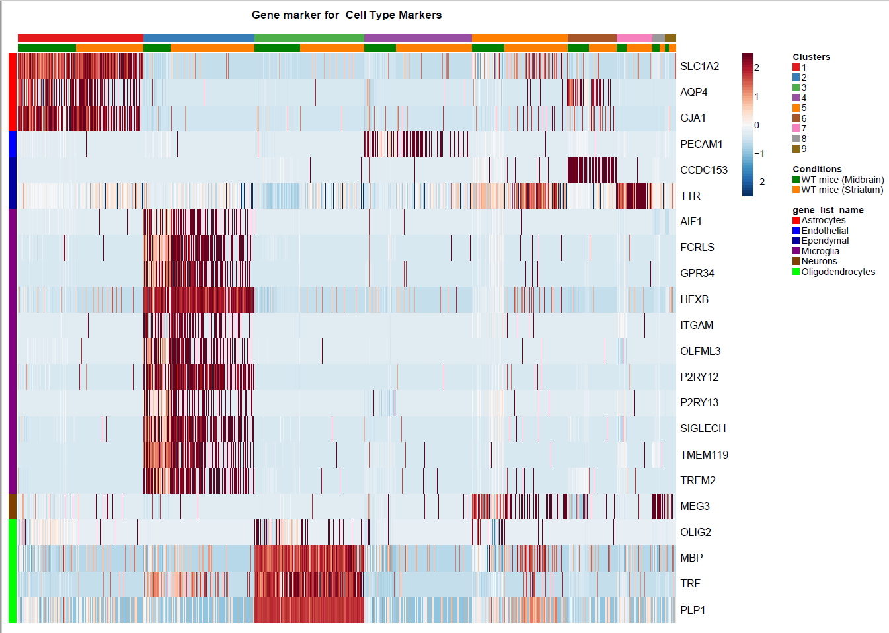
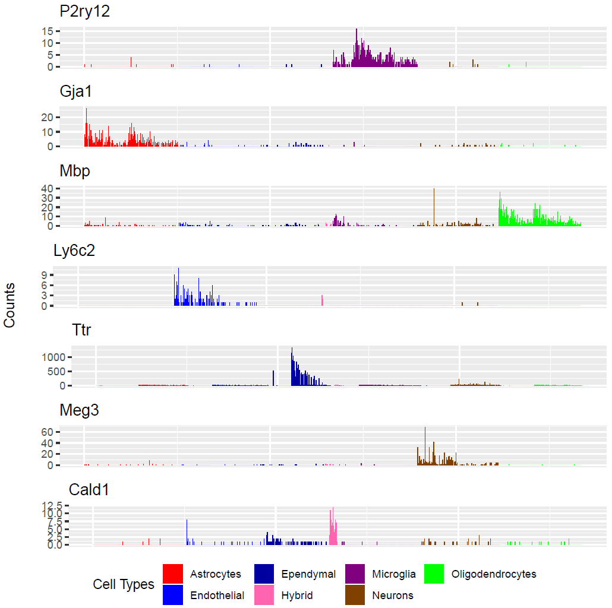
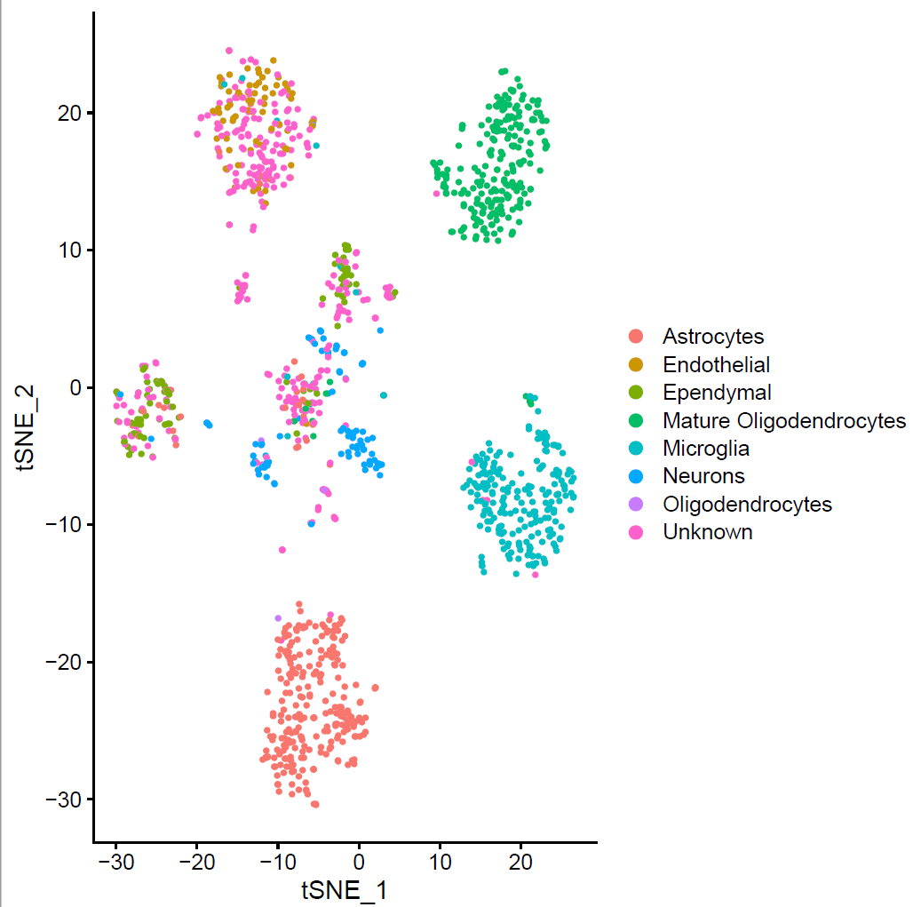
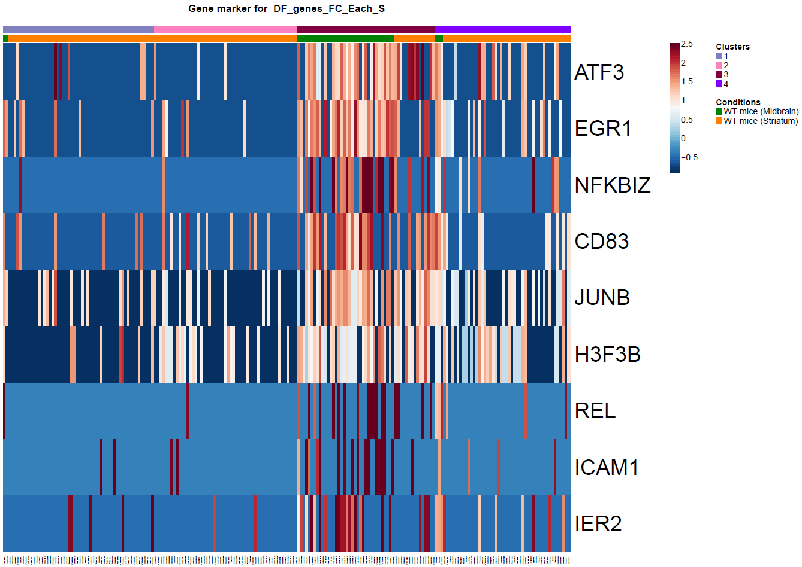
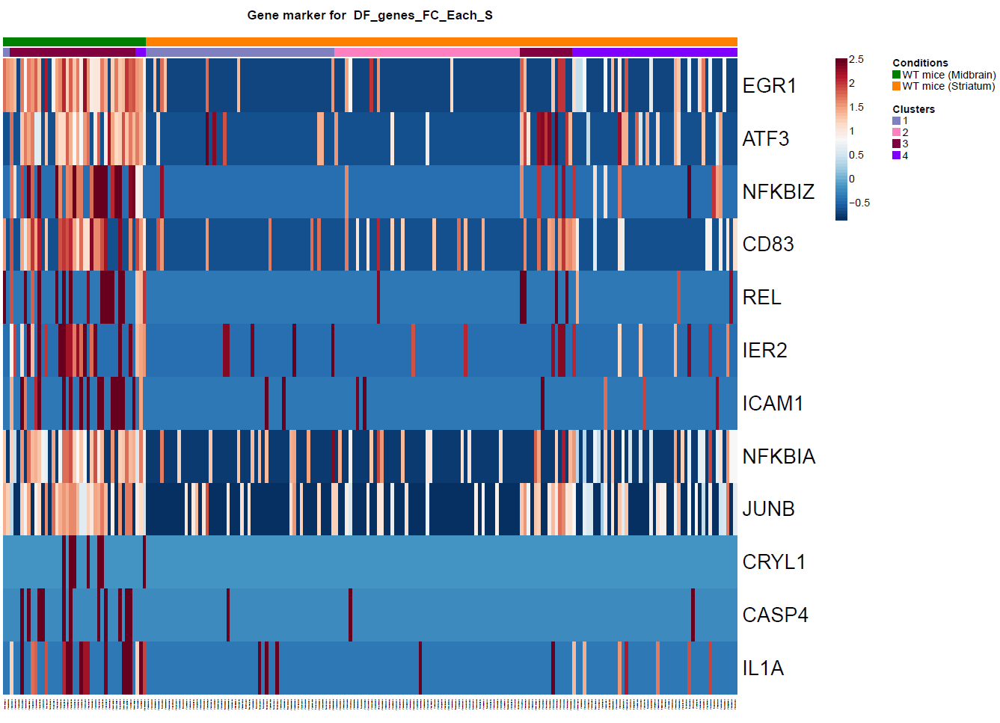

# Mouse microglia regional heterogeneity in single cell resolution

### RNA-seq analysis

#### R session information

For requirements, please see the file RNA-seq_sessionInfo.txt for specific R packages and their versions.
Something to add

#### Preprocessing

R code to preprocess single-cell RNA-seq data from scratch can be found in the src directory. Steps (e.g. quality control,normalization, clustering etc.) should be run in the order indicated by the leading counter in the filename (e.g. Outliers_Detectio,.R, Clustering.R )

#### Figures

We additionally provide scripts to reproduce most of the main figures.
The R code can be found in the figure_src directory and is split into individual files.
Figures can be recreated without the need of preprocessing the data. **NOT READY YET**

### Citation

Please refer to the following research article when using data from this repository:

O. Uriarte

## Overview

### Quality control
(**Folder: QC**)
We filtered out the low quality cells and genes separately in each data set. We defined cells as low-quality, based on three criteria for each cell.  The number of the genes that expressed is more than 200 and 2 median-absolute- deviations (MADs) above the median, the total number of counts is 3 MADs above or below the median and the percentage of counts to mitochondrial genes is 1.5 median-absolute- deviations (MADs) above the median. Cells failing at least two criterion were considered as low quality cells and filtered out from further analysis (Sup. Fig1). Similar to the cell filtering, we filtered out the low quality genes that been expressed in less than 10 cells in the data.

We used Seurat v3.1 for the analysis of the gene expression matrix. We merged the gene expression matrices from striatum and midbrain. After the filtering, the count data of 1337 cells and 13446 genes was used for the downstream analysis. To identify the different cell types, we clustered the cells and visualized clusters using a t-distributed stochastic neighbor embedding (t-SNE) plot (Fig. 1 b). The resolution for the Louvain clustering, selected based on the silhouette score performance of different resolutions. This revealed eight main clusters. 

### Cell Identity
(**Folder: Cell Types, DF_Clusters, Garnett**)
In order to recover the cell type identity of each cluster we performed one unsupervised and one supervised workflow.  In the former, we performed a differential expression analysis between the clusters. The genes that popped up as differentially expressed, were searched in literature and we linked them with specific cell types (Fig1 d). In the latter one, we used known cell specific markers (Fig1 e).  These two workflows let us assign each cluster to cell types (Fig1 c,f).  In the folder DF_Clusters there are also barplots for the 3top markers for each cluster.

<figure>
  
  
  
  
  
  <figcaption><b>Fig.1:</b> Two-dimensional t-SNE plot of 1036 individual cells at two different regions of mouse brain. Each dot represents a single cell.  
  <b>a)</b> The colors correspond to different regions of the mouse brain. 
  <b>b)</b> t-SNE plot where the colors correspond to eight different clusters. 
  <b>c)</b> The colors correspond to different cell types, which were assigned based on specific cell markers. 
  <b>d)</b> Heat map of the top 15 differentially expressed genes for each cluster. 
  <b>e)</b> Heat map using specific cell type markers.
  <b>f)</b> Bar plot of cell type markers of each cell, colored based on the different cell types.
  <b>g)</b> Bar plot of with the number of cells from the different brain regions per clusters.</figcaption>
</figure>

<figure>
    
    <figcaption>t-SNE plot where the colors correspond to garnett cell identity assignment using as cell type markers (<b>Oligodendrocytes:</b> Mog, Mag, Plp1, Mbp, Ermn, Enpp6, Pdgfra, Olig1, Olig2, Cspg4 , <b>Astrocytes:</b> Slc1a2, Aqp4, Gja1, <b>Microglia:</b> Tmem119, P2ry13, Aif1, Cts3, Cx3Xr1, <b>Neurons:</b> Syn1, Gad1, Gad2, Th, Meg3, Slc17a6
, <b>Endothelial:</b> Pecam1, Dcn, Igfbpl1, <b>Ependymal:</b> Igf2, Ccdc153).</figcaption>
</figure>

### Microglia Subpopulations
(**Folder: Microglia_Analysis_intergraded**)
Since we focus here on the microglia, we subset the data and keep only the cells that were identified as microglia.
We re calculate the most variable genes only in microglia population and then re-project and cluster these cells. (**Folder: Microglia_Analysis_intergraded**)
This revealed four different clusters (Fig2, a). The minor cluster (cluster 4) seems to express also oligodendrocyte markers. This also supported by the assignment of the cell identities using garnett.

**&ast;The differential expression analysis was based on counts and not on the intergraded data, as suggesterd in https://satijalab.org/seurat/faq.html FAQ4.**

<figure>
    
    
    <figcaption><b>Fig.?:</b> Heatmap of the differentially expressed genes. 
    <b>a)</b> tSNE projection of Microglia 
    <b>b)</b> Differentially expression analysis between the microglia subpopulations.</figcaption>
</figure>

We filtered out the fourth cluster from the further analysis. Then we performed differential expression analysis between the clusters and the brain regions (Fig2, b). 

#### Differential Expression Between Clusters
<figure>
    
    
    <figcaption><b>Fig.?:</b> Heatmap of the differentially expressed genes. 
    <b>a)</b> Differentially expression analysis between the microglia subpopulations using Seurat. 
    <b>b)</b> Differentially expression analysis between the microglia subpopulations using Seurat.</figcaption>
</figure>
   
Also, I selected these genes to see the expression of them. Clearly there is a pattern. In monocle some of them poped up as df using the qvalue as criterion of significance, and thery are not the top ones.
 

USING MONOCLE 
  status           family         pval         qval gene_short_name cluster avg_logFC
18     OK negbinomial.size 1.024243e-07 7.649955e-05           FCRLS       2 0.5152343 
33     OK negbinomial.size 8.344491e-06 3.399495e-03            LGMN       2 0.2808261 
35     OK negbinomial.size 1.137905e-05 4.370856e-03          P2RY12       2 0.4344634 

  
USING SEURAT 
"p_val" "avg_logFC" "pct.1" "pct.2" "p_val_adj" "cluster"   "gene"  "qvalue"  

FCRLS    0.0044853224 0.60979248 0.717 0.516         1       2    FCRLS 0.3163782 
FCRLS1   0.0002867274 0.08859532 0.860 0.475         1       4    FCRLS 0.0642556 
MARCKSL1 0.0026819585 0.89271831 0.137 0.019         1       3 MARCKSL1 0.2372475 
P2RY12   0.0096385813 0.40286161 0.906 0.745         1       2   P2RY12 0.4044896 
P2RY121  0.0021027255 0.05468595 0.940 0.738         1       4   P2RY12 0.2122506 

#### Differential Expression Between Conditions

<figure>
    
    <figcaption>Fig.2: Heatmap of the differentially expressed genes between brain regions.</figcaption>
</figure>

### Another workflow
WE used also the counts (which is not suggested) in order to project the data. This analysis is in the Folder (**Folder: Microglia_Analysis_counts**)

